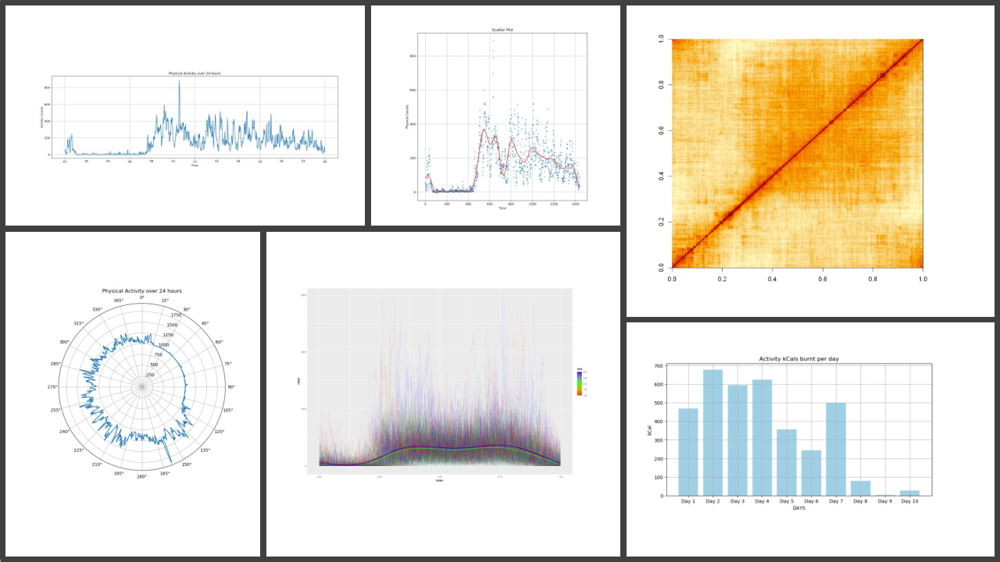

# Functions for processing accelerometer data
Gregory Farage1, Zoran Bursac2, Śaunak Sen1

>1Department of Preventive Medicine, College of Medicine, University of Tennessee Health Science Center, Memphis, TN   
2Department of Biostatistics, Stempel College of Public Health & Social Work, Florida International University, Miami, FL 

 

